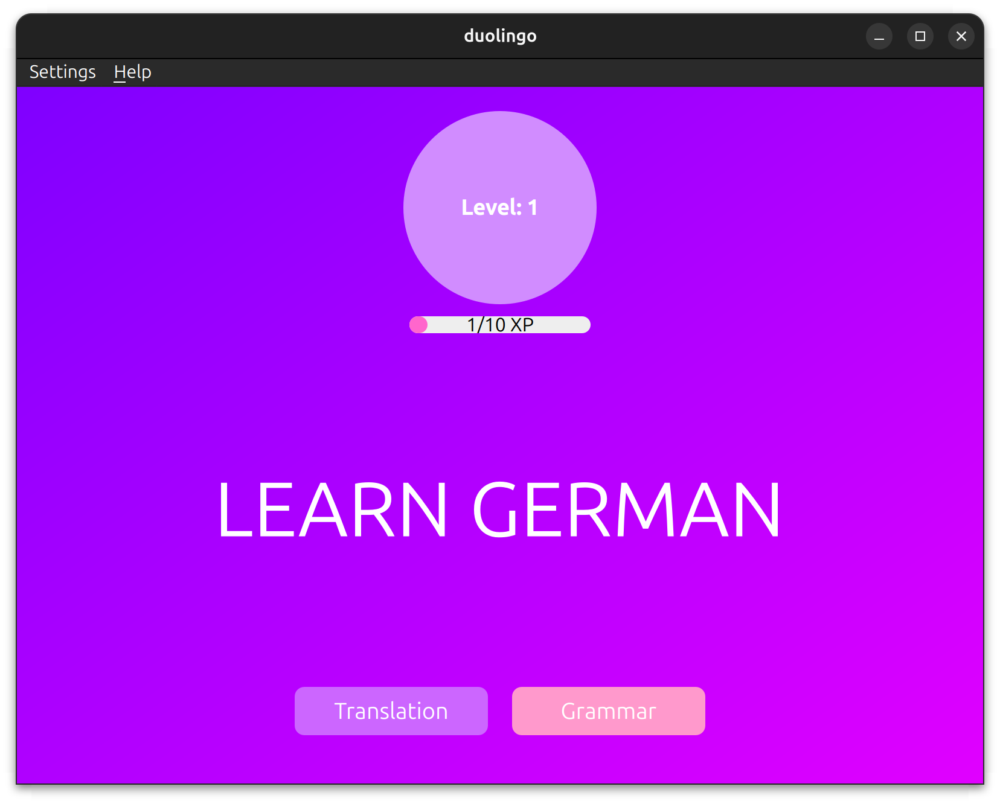
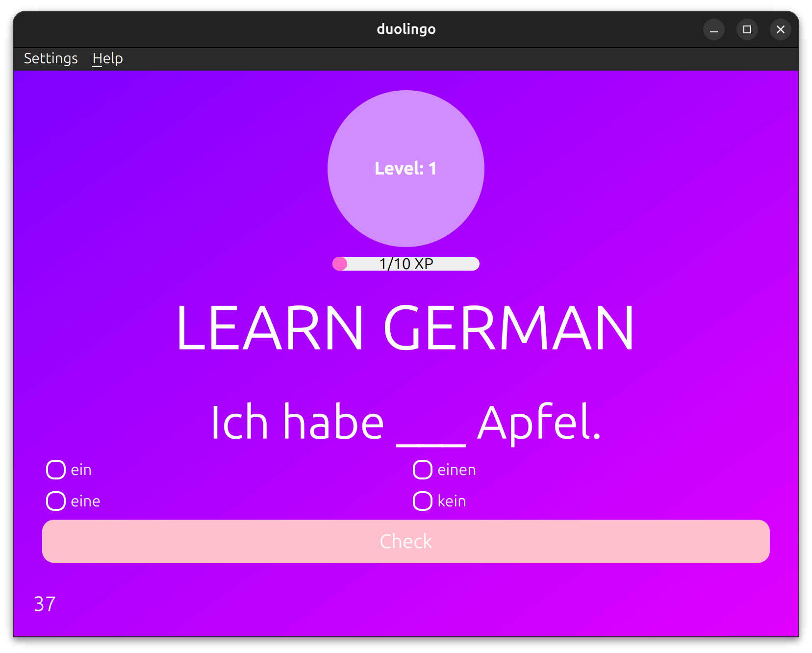

# 🇩🇪 Learn German with Sparkle & Fun! 💖

A **colorful, interactive language-learning application** inspired by Duolingo's style, designed to make German grammar and translation exercises delightful! 🎮📚

---

## 🌸 Key Features

- **Interactive Exercises** 🧠
    - 🔤 Translation Challenges
    - 📐 Grammar Quizzes
- **Progress Tracking** 📈
    - 🌟 Level System (Level 1 ➜ Level Up!)
    - 💎 Experience Points (XP) Bar
- **Custom Difficulty** 🎚️
    - 🟢 Easy | 🟡 Medium | 🔴 Hard
- **Responsive Design** 📱💻
    - Automatically adapts to window size!
- **Gamified Elements** 🎉
    - ⏱️ Timed Challenges
    - 🎵 Sound Effects & Hints

---

## 🖼️ Screenshot Preview

  
*Main Interface with Pink Gradient Theme*

  
*Interactive Grammar Exercise*

---

## 🚀 How to Use

1. **Launch App** 💫  
   ```bash
   bazel run //labs/duolingo
   ```

2. **Select Difficulty** 🎯  
   Press `Ctrl+D` or go to Settings ➜ Select Difficulty

3. **Choose Exercise Type** 🎲
    - 🔤 Translation Button (Left)
    - 📖 Grammar Button (Right)

4. **Answer Questions** ✍️
    - Timer runs out if you don't answer fast enough ⏳
    - Earn XP for correct answers 🎯

5. **Get Help** ❓  
   Press `H` for hints during grammar exercises!

---

## 🛠️ Technologies Used

- **C++** with **Qt6** Framework 🖥️
- **SQLite** Database for Questions & Progress 💾
- **Bazel** for Build System 🛠️
- **QSoundEffect** for Audio Feedback 🎵

---

## 🌟 Pro Tips

- 💡 Use `Ctrl+D` to change difficulty anytime!
- 🕒 Answer quickly to beat the timer 🏃‍♀️
- 📊 Your progress saves automatically to SQLite 💾
- 🎨 Everything resizes beautifully with window size 🖼️

---

# 🙌 Thank You for Learning German with Us! 💖
